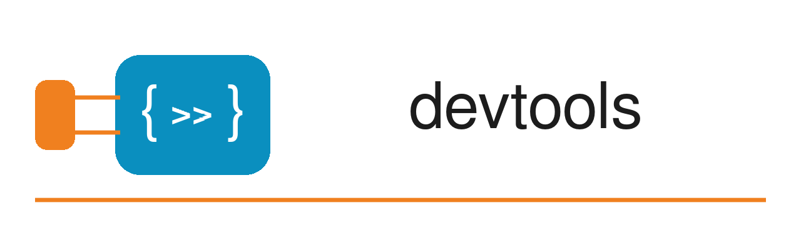

Developer tooling for GNU Octave: tools for questions only the interpreter can
answer about itself, packaged so that a program outside Octave can ask.

Everything described here is implemented and tested on GNU/Linux. Release 0.1.0
was also tested on Windows; sandbox mode, new in 0.2.0, runs on Linux only.

## What belongs here

Something belongs in this package if answering it requires the interpreter's
own knowledge of itself, packaged so that a program outside Octave can ask. The
test admits protocol servers, documentation and packaging checks, and an index
of what the ecosystem provides. It excludes anything needing none of that
knowledge, a source formatter being the clearest example.

## What is here

| Surface | What it is | How you reach it |
|---|---|---|
| `devtools.mcp` | Model Context Protocol server, read-only | configure it in an MCP host |
| `devtools.mcpEval` | the same, plus evaluation, optionally inside a sandbox | configure it in an MCP host |
| `devtools.selftest` | a check that the servers start and stay clean, a sandboxed one included | call it from Octave |

A surface reached over a protocol is documented here, because the program using
it never sees an Octave prompt and cannot ask `help`. Anything you call
yourself is documented in its own help text instead, so `help devtools.selftest`
is the whole of that one.

## Requirements

GNU Octave 11.1.0 or later.

A C++ compiler is **optional**. The package installs without one and the
read-only server is unaffected; what the evaluating server loses is described
under [What contains it](#what-contains-it-and-what-does-not).

[Sandbox mode](#sandbox-mode) needs Linux, `bwrap` from the `bubblewrap`
package, and `prlimit` from `util-linux`. It needs no compiler.

## Installation

```
pkg install devtools
```

Install the latest dev version from the Octave command prompt by typing

```
pkg install "https://github.com/pr0m1th3as/octave-devtools/archive/refs/heads/main.zip"
```

Load the package by typing

```
pkg load devtools
```

## Model Context Protocol

Two [Model Context Protocol](https://modelcontextprotocol.io) servers, exposing
GNU Octave to any MCP-capable assistant. Both protocol eras are served by
either.

### The server is an Octave interpreter

The server process *is* an Octave interpreter. There is no wrapper process and
no second copy of the truth: the interpreter answering "what does `kmeans` do"
is a real Octave, with a real load path, resolving names exactly as Octave does.

**It sees the packages its own launch command loads, and no others.** The
commands below load only `devtools` itself, so `octave_which` will not find a
function from `statistics` unless you say so. Load what you want it to see:

```
--eval "pkg load devtools statistics datatypes; devtools.mcp ()"
```

That is a deliberate choice rather than an oversight: loading every installed
package would execute each one's `PKG_ADD`, which is other people's code running
at startup, and the read-only server's whole claim is that it runs none.

### Two servers, and why they are separate

| Entry point | What it does | Configure it as |
|---|---|---|
| `devtools.mcp` | read-only introspection. **Evaluates no code, runs no user function, and writes nothing** | `octave` |
| `devtools.mcpEval` | the same, plus running code and running tests | `octave-eval` |

They are separate functions, separate commands and separate entries in your
host's configuration, so that a host configured for one cannot reach the other.
That is the point: the read-only claim above is flat and checkable, which is
what makes it reasonable to grant that server blanket permission, and it would
mean nothing if a flag could turn evaluation on.

Configure whichever you want. Configuring both is fine, and gives your host a
tool set it can be trusted with by default and one it must ask about.

The evaluating server runs code in your interpreter, contained but not
sandboxed, unless it is started in [sandbox mode](#sandbox-mode). Read [What
contains it, and what does not](#what-contains-it-and-what-does-not) before
configuring it.

### Configuration

The read-only server:

```json
{
  "mcpServers": {
    "octave": {
      "command": "octave-cli",
      "args": ["-q", "--no-init-file", "--eval", "pkg load devtools; devtools.mcp ()"]
    }
  }
}
```

The evaluating server, under its own name:

```json
{
  "mcpServers": {
    "octave-eval": {
      "command": "octave-cli",
      "args": ["-q", "--no-init-file", "--eval", "pkg load devtools; devtools.mcpEval ()"]
    }
  }
}
```

The evaluating server in [sandbox mode](#sandbox-mode), on Linux, under a name of
its own. What it may read and load is set in `env`, never in the command:

```json
{
  "mcpServers": {
    "octave-sandbox": {
      "command": "octave-cli",
      "args": ["-q", "--no-init-file", "--eval", "pkg load devtools; devtools.mcpEval ('Sandbox', true)"],
      "env": {
        "DEVTOOLS_SANDBOX_FOLDERS": "/home/me/analysis",
        "DEVTOOLS_SANDBOX_PACKAGES": "statistics,datatypes"
      }
    }
  }
}
```

**Do not shorten any of these command lines.** The server communicates over standard
output, so anything written there that is not a message corrupts the stream,
and a corrupted stream usually appears in the host as an unexplained connection
failure.

- `--no-init-file` skips `~/.octaverc`, which may print. Its output arrives
  before the server starts running, so the server cannot undo it. This flag is
  load bearing.
- `-q` suppresses the startup banner. Measured on 11.2.0, `--eval` already
  makes the run non-interactive and no banner is written either way, so today
  the flag changes nothing; it is kept because nothing else guards that output
  if a future release prints it.

**On Windows, name `octave-cli.exe` in full.** A host spawns the command
without a shell, so a bare `octave-cli` is found only if the interpreter is
already on `PATH`, which a Windows installation does not guarantee. When it is
not, the process never starts and there is no output of any kind to diagnose it
with, which reads like the corrupted stream above and is nothing to do with it.
Give the path instead and change nothing else:

```json
      "command": "C:\\Octave\\octave-11.2.0-w64\\mingw64\\bin\\octave-cli.exe",
```

A configuration file cannot set `PATH`, so this is the only remedy where the
interpreter is not on it. Both stanzas were verified this way and produce
byte-identical output whether the command is found by `PATH` or named in full.

To check a configuration before blaming the host, run

```
devtools.selftest ()
```

which starts both servers exactly as configured above, completes a handshake,
holds a pipe open across two bursts of requests the way a host does, drives a
call that spawns a subprocess and one that never returns, and reports whether
standard output stayed clean throughout, naming the offending first line if it
did not.  It reads standard error as well, where the server's own
diagnostics belong but a diagnostic the interpreter raised about the server
does not. Where Linux, `bwrap` and `prlimit` are present it also starts a
sandboxed server, checks that it reports itself sandboxed and offers the
sandbox's tools, and runs a call in it; elsewhere those checks are reported as
skipped, with the reason.

### Tools

Read-only, served by both entry points:

| Tool | Answers |
|------|---------|
| `octave_which` | where a name resolves, its kind, its owning package, what it shadows, and whether it is merely installed rather than loaded |
| `octave_help` | the help text for a function, class, method or operator |
| `octave_search` | which functions match a description, when the name is not known |
| `octave_pkg` | which packages are installed, at which versions, and which are loaded |
| `octave_registry` | which packages anywhere in the Octave Packages index provide a name, from a dated snapshot |

Served by `devtools.mcpEval` only:

| Tool | Answers |
|------|---------|
| `octave_eval` | what running some Octave code produces, in a workspace that persists between calls |
| `octave_test` | how many of a function's built-in tests pass, and what failed |

Served by `devtools.mcpEval` in [sandbox mode](#sandbox-mode), in place of the
two above:

| Tool | Answers |
|------|---------|
| `octave_call` | for programs: what one function returns for typed arguments, as typed cells in `structuredContent`, with what it printed |
| `octave_test` | how many of a function's built-in tests pass, and what failed |

The Octave version and platform are not a tool: they are stated in the
server's `instructions`, sent once when a client connects, so a model always
has them and no request pays for them.

One resource is offered, `octave://environment`: version, platform, load path
size and the packages this server loaded, as a single readable snapshot.

### Evaluation

#### Workspaces

Code runs in a workspace named by an opaque handle. Every call names one:
`new` opens a workspace and the reply gives its handle, and passing that handle
back continues it. Variables persist, `clear` works, and two workspaces cannot
see each other.

The handle is required rather than optional, which is deliberate. A model that
omits an argument is the ordinary case rather than the exotic one, and an
omitted handle taken to mean "start clean" would lose a workspace in silence:
the next call would find its variables missing with nothing said about why. A
handle that has expired is a tool error that says so.

Eight workspaces live at once and the oldest is dropped, which bounds how far
back a handle can be reused rather than limiting what one may hold.

A sandboxed server has no workspaces: every call starts from the same state.

#### The deadline

An evaluation still running after twenty seconds is stopped and the reply says
so. What the code assigned before it was stopped is still in the workspace, and
what it printed is still returned, which is the difference between this and
letting your host restart the process.

Set `DEVTOOLS_EVAL_SECONDS` in the launch command, up to six hundred, where the work
honestly takes longer:

```json
"env": { "DEVTOOLS_EVAL_SECONDS": "120" }
```

It is not a tool argument, because that would cost tokens in every request and
is a decision for whoever configures the server rather than for the model.

#### What contains it, and what does not

Output is captured at the file descriptors, so what evaluated code prints comes
back in the reply rather than into the stream that carries the protocol. That
includes what a subprocess prints, which nothing inside the interpreter can
catch, and what a warning writes, and it arrives in the order it was written.

`input` and `keyboard` are shadowed while a call runs, since there is no
terminal for either to read from.

**None of this is a sandbox**, unless the server was started in [sandbox
mode](#sandbox-mode). Evaluated code can read and write files, use the
network, and consume memory exactly as any code in your interpreter can. The
containment is about keeping the protocol stream intact and getting the server
back when code does not return, not about defending against code that means
harm. Configure this server only where that is acceptable.

Where the package was installed without a compiler, two of those guarantees
weaken: there is no deadline, and a subprocess is contained by name rather than
at the descriptor. `system` still runs, taking its output back and printing it
through the interpreter, so ordinary code and core's own `copyfile`, `ls` and
`unpack` are unaffected. What is refused is `popen` opened for writing and an
asynchronous `system`, whose output cannot be taken back at all. The read-only
server is unaffected either way.

#### Sandbox mode

`devtools.mcpEval ('Sandbox', true)` runs the evaluating server inside a
sandbox built with `bwrap`, on Linux only. It was made for programs that pass
data to Octave from somewhere untrusted, a spreadsheet for one, and need a
server that can call a function and do nothing else.

Before it answers anything, the server checks from inside that the sandbox
holds, and refuses to serve if it does not. Every result then carries
`_meta["io.github.pr0m1th3as.devtools/sandbox"]` set to `true`, a key absent
from a server that is not sandboxed, and the server's `instructions` say so.

Visible inside, read-only:

- the system libraries, Octave's own installation and the `octave-cli` binary;
- the packages named in `DEVTOOLS_SANDBOX_PACKAGES`, separated by commas and
  loaded in that order, with every package they depend on, and no other
  package;
- the folders named in `DEVTOOLS_SANDBOX_FOLDERS`, separated by `:`, which are
  on the load path ahead of the packages.

Not visible: `/usr/bin`, so there is no shell and no program to start; the rest
of your home directory, Octave's history included; and the network. The only
writable place is an in-memory `/tmp`. A folder that is your home directory,
contains Octave's history, or lies inside `/tmp`, `/proc` or `/dev` is refused.

Each call runs in a process forked for it, which starts from the same state
every time and is killed when it returns or when the deadline passes, together
with any process it started, and `/tmp` is emptied before the next call. A call
that crashes the interpreter comes back as an error and the server keeps
serving. The address space of the sandbox is limited to the launching
process's size plus 2 GB, and `/tmp` holds at most 2 GB; set
`DEVTOOLS_SANDBOX_MEMORY` and `DEVTOOLS_SANDBOX_TMP` to other numbers of
gigabytes to change them.

A sandboxed server offers `octave_call` and `octave_test`, and not
`octave_eval`. `octave_call` is for programs, such as `octave-calc`, not for
an assistant: its results are in `structuredContent`, and its text is a
one-line summary without the values. It takes a function name, never code:

| Argument | What it holds |
|---|---|
| `function` | a function name, such as `mean` or `geom.area` |
| `args` | the arguments in call order, each `number`, `string`, `logical` or `range` |
| `nargout` | how many outputs to return, from 1 to 16, 1 when omitted |
| `nullDate` | the date that serial number 0 stands for, `1899-12-30` when omitted |

A range carries its rows, its columns and its cells row by row, each cell with
a kind (`empty`, `number`, `logical`, `text`, `error`, `date`, `datetime`,
`time` or `duration`) and a value. A numeric range becomes a matrix with `NaN`
for an empty cell, a text range a cell array of text, a range of dates a
`datetime` and a range of times a `duration`, and a range mixing kinds a cell
array. A range holding an error cell is refused. Dates and times need
`datatypes` among the sandbox's packages.

Each output comes back as its kind, class, rows, columns and cells row by row,
with `NaN` as `null`, `Inf` and `-Inf` as the strings `"Inf"` and `"-Inf"`, and
dates as serial numbers from `nullDate`. What the function printed comes back
beside the outputs, and an Octave error as its message and identifier.
Functions that run programs or call another function by name, such as `system`
and `feval`, are refused by name.

### Conformance

`MCP_PROTOCOL.md` records what this package implements and against which
revision, quoting the specification and naming the source page for every
answer. Revision `2026-07-28`, with two deviations, each registered beside the
sentence it departs from.

## License

GPLv3 or later. See `COPYING`.
